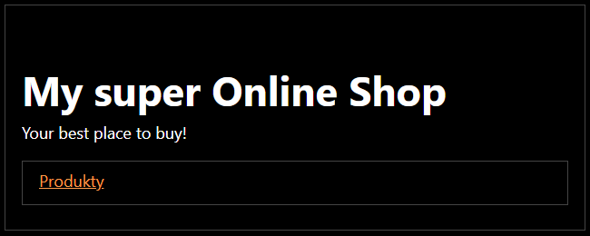
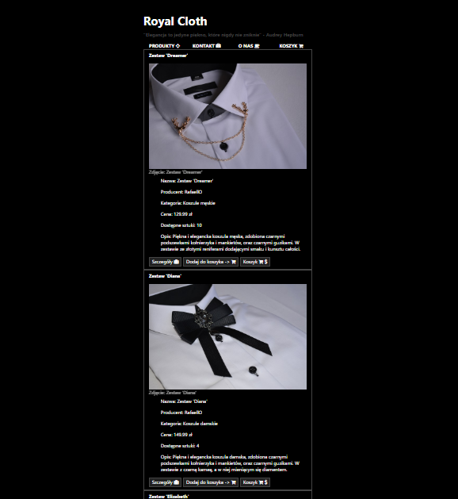
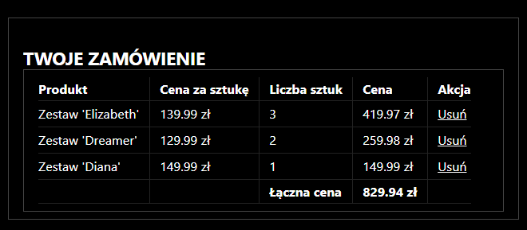

### Only presentation: 

###### I'm working on a project. This is my own project made from scratch on the basis of the previous jsp made in the old technology. Ultimately, it will be a clothes store. I was based on ready-made entities from the previous project, which I will gradually adapt to the needs of "clothes"

### Technology used: 
* JAVA+SPRING (backend)
* THYMELEAF (frontend)
* (and more from java&spring family)

### About the application

#### Index

#### Main endpoint with products

#### Cart endpoint

