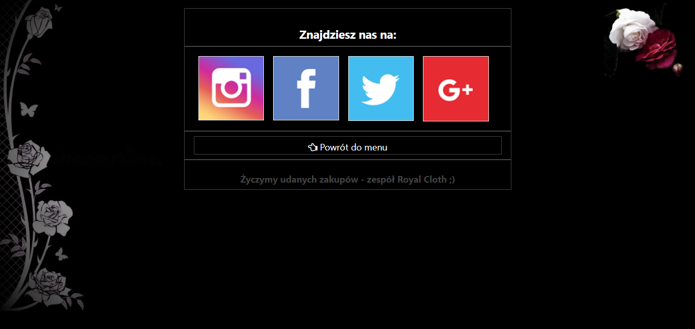

(with this button you open the url of my application, this application may need some time to run)
(starting the app can take max 10 seconds)

### Only presentation: 

###### I'm working on a project. This is my own project made from scratch. I still need a long time to finish. I am currently working on changing the data storage model in the application. It's best to see the effects by clicking the "Deploy" button.

### Technology used: 
* JAVA+SPRING (backend)
* THYMELEAF (frontend)
* (and more from java&spring family)

### About the application

#### Products

#### Cart

#### Comment

#### Contact

